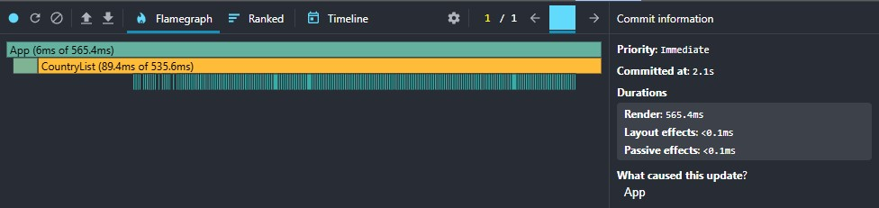
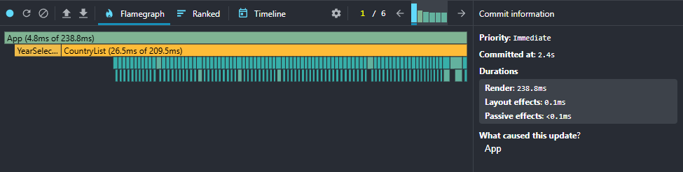
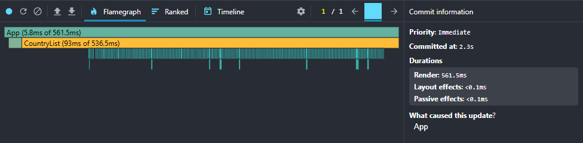
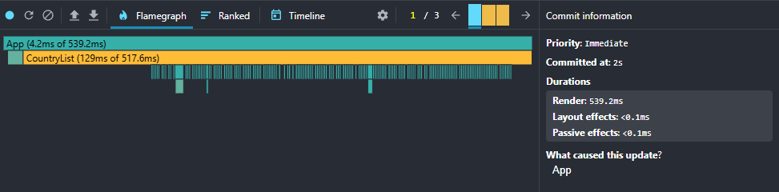

# Performance Optimization Report

## Baseline Measurements

### Interaction A: Sort countries

- **Commit duration**: 2.1 s
- **Render duration**: 565.4 ms
- **Screenshot**: 

### Interaction B: Search countries

- **Commit duration**: 2.4 s
- **Render duration**: 238.8 ms
- **Screenshot**: 

### Interaction C: Change year

- **Commit duration**: 2.3 s
- **Render duration**: 561.5 ms
- **Screenshot**: 

### Interaction D: Toggle column

- **Commit duration**: 2 s
- **Render duration**: 539.2 ms
- **Screenshot**: 