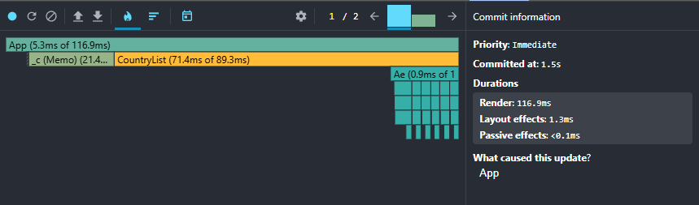
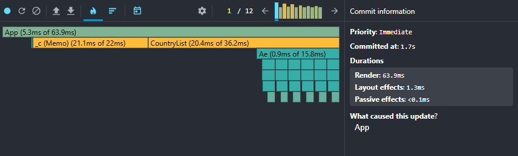
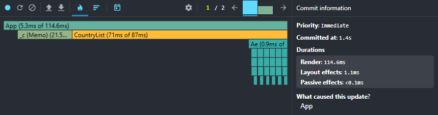
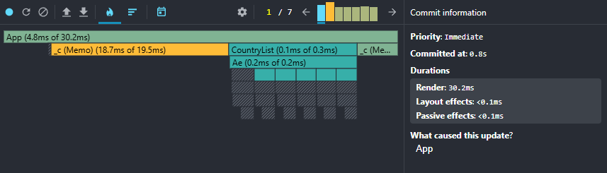

# Performance Optimization Report

## Baseline Measurements

### Interaction A: Sort countries

- **Commit duration**: 2.1 s
- **Render duration**: 565.4 ms
- **Screenshot**: 

### Interaction B: Search countries

- **Commit duration**: 2.4 s
- **Render duration**: 238.8 ms
- **Screenshot**: 

### Interaction C: Change year

- **Commit duration**: 2.3 s
- **Render duration**: 561.5 ms
- **Screenshot**: 

### Interaction D: Toggle column

- **Commit duration**: 2 s
- **Render duration**: 539.2 ms
- **Screenshot**: 

## Optimized Measurements

### Interaction A: Sort countries

- **Commit duration**: 1.5 s
- **Render duration**: 116.9 ms
- **Screenshot**: 

### Interaction B: Search countries

- **Commit duration**: 1.7 s
- **Render duration**: 63.9 ms
- **Screenshot**: 

### Interaction C: Change year

- **Commit duration**: 1.4 s
- **Render duration**: 114.6 ms
- **Screenshot**: 

### Interaction D: Toggle column

- **Commit duration**: 0.8 s
- **Render duration**: 30.2 ms
- **Screenshot**: 

## Summary of Improvements

| Interaction      | Baseline (ms) | Optimized (ms) | Improvement |
| ---------------- | ------------- | -------------- | ----------- |
| Sort countries   | 565.4         | 116.9          | 79.3%       |
| Search countries | 238.8         | 63.9           | 73.2%       |
| Change year      | 561.5         | 114.6          | 79.6%       |
| Toggle column    | 539.2         | 30.2           | 94.4%       |
| **Average**      | **476.2**     | **81.4**       | **82.9%**   |